# Документация для библиотеки GudeAPI

## Установка

Библиотеку доступна для скачивания через пакетный мэнаджер *__[Composer](https://getcomposer.org/)__*.

Для начала создаём файл index.php и открываем его в любом удобном редакторе кода или IDE, я пользуюсь редактором [__Visual Studio Code__](https://code.visualstudio.com/)

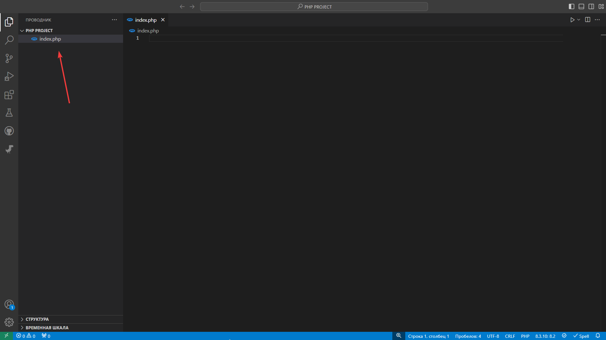


Теперь открываем терминал, ( *в данном случае я открою встроенный в мой редактор кода терминал, сочетание клавиш:* __Ctrl + `__ )

Переходм в нашу директорию с файлом index.php и вставляем в терминал команду:

```bash
composer require maxproger338/gudeapi
```

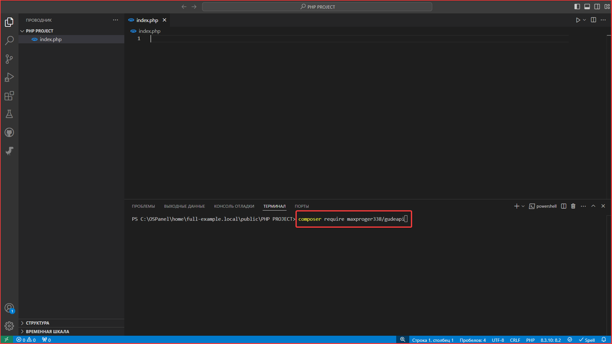

После чего у вас в директориии должна появиться папка Vendor и ещё два файла: composer.json и composer.lock

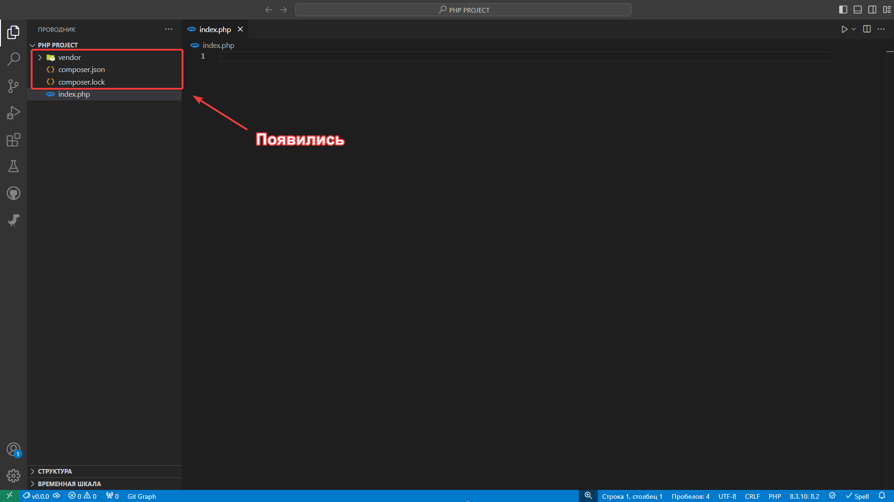

Отлично! Если вы сделали всё правильно, то поздравляю, вы устанавили модуль!

Теперт же его нужно подключить в index.php

```php
<?php

require_once __DIR__ . "/vendor/autoload.php";
```

Теперь подключаем все необходимые namespace

```php
// Наш основной класс
use GudeAPI\GudeAPI; 

// Режимы API
use GudeAPI\RequestType;
```

Теперь нам доступен основной класс GudeAPI

Он принимает один параметр и это режим его работы 
Берётся он из GudeAPI\RequestType

Список доступных режим:

* PATH - принимает на вход параметры: 
    + идентификатор - это строка-путь, при котором будет срабатывать API

Режим *__PATH__*:

Чтоб работал режим PATH нужно создать ещё один файл .htaccess

```.htaccess
RewriteEngine On
RewriteCond %{REQUEST_FILLNAME} !-f
RewriteRule ^(.+)$ index.php?q=$1 [L,QSA]
```

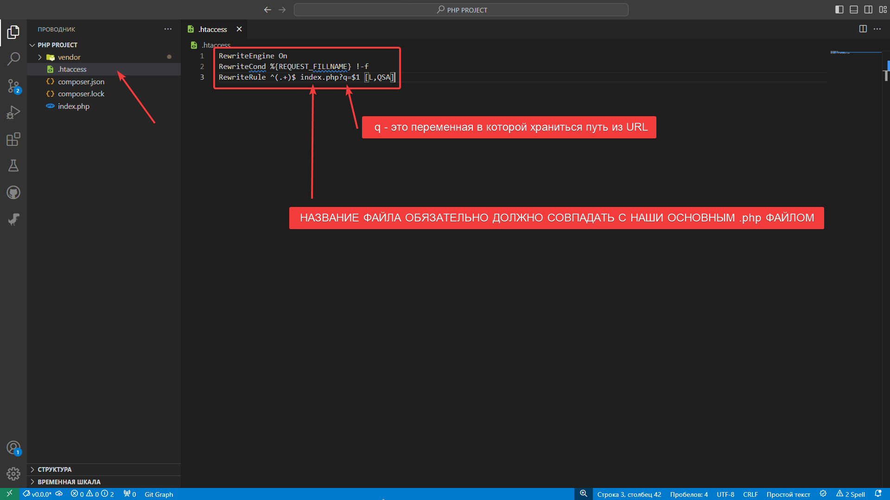

__ПРЕДУПРЕЖДЕНИЕ: Переменная q должна называться одинаково в файле .htaccess и в vendor/maxproger338/src/Configs/RequestConfig.php в функции VARIABLE_QUERY_NAME()__

__ПРЕДУПРЕЖДЕНИЕ: наш основной .php файл должен называться также, как и в .htaccess__

После настройки .htaccess открываем файл index.php

И начинаем писать

```php
// Инициализируем объект
$api = new GudeAPI(
    // Задаём режим
    // в режиме задаём идентификатор
    RequestType::PATH("posts/langs");
);
```

Режим как и идентификатор можно не вводить в конструктор,
только при условии что вы их зададите потом в соответстующих методах

Для режима - setRequestProperties()

Для идентификатора - setIdentifierInRequestPath()

__ПРИМЕЧАНИЕ__: ЕСЛИ НЕ УКАЗАН РЕЖИМ, ТО ПРИ ПОПЫТКЕ ЗАДАТЬ ИДЕНТИФИКАТОР ПРОИЗОЙДЁТ ОШИБКА __InvalidProperty: RequestType пути не указан__

Чтобы получить режим - getRequestType()

Чтобы получить идентификатор - getIdentifierInRequestPath()

```php
<?php

require_once __DIR__ . "/vendor/autoload.php";

// Наш основной класс
use GudeAPI\GudeAPI;

// Режимы API
use GudeAPI\RequestType;

// Инициализируем объект
$api = new GudeAPI();

// Указываем режим
$api->setRequestProperties(
    RequestType::PATH() 
    // Можно указать идентификатор ещё и тут
    // RequestType::PATH("posts/langs") 
);

// Указываем идентификатор
$api->setIdentifierInRequestPath("posts/langs");

// Выводим режим
echo $api->getRequestType()->name;
echo PHP_EOL;
// Выводим идентификатор
echo $api->getIdentifierInRequestPath(); 
```

Дальше после настройки идентификатора, вызываем функцию PATH
у нашего объекта $api

Функция PATH вызывает переданную ей функцию action и возвращает true, когда URL совпадает с нашим идентификатором и постфиксом ( постфикс передаёться как аргумент функции ) и HTTP метод равен методу переданному в функцию

Функция PATH принимает такие параметры как:
    
    * method - HTTP метод при котором будет срабатывать API

    * postfix - строка-почтфикс, которая идёт после вашего идентификатора в URL ( он тоже должен совпадать )
    
    * action - пользовательская функция, которая будет срабатывать, когда совпали URL с вашим идентификатором и постфиксом
    

```php
<?php

require_once __DIR__ . "/vendor/autoload.php";

// Наш основной класс
use GudeAPI\GudeAPI;

// Режимы API
use GudeAPI\RequestType;

// Список HTTP методов
use GudeAPI\HTTPMethod;

// Инициализируем объект
$api = new GudeAPI(
    RequestType::PATH("posts/langs")
);

// Вызываем функцию для проверки URL
$api->PATH(HTTPMethod::GET, "PHP/functions", function() {
    echo "Success!";
});

```

Теперь обратившись по адресу "наш файл/posts/langs/PHP/functions" и отправить запрос нужным нам методом, нам вернёт "Success!"

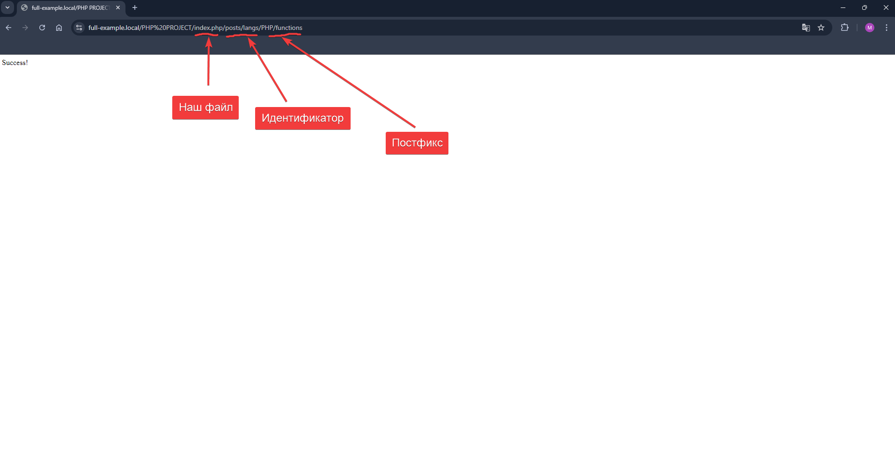

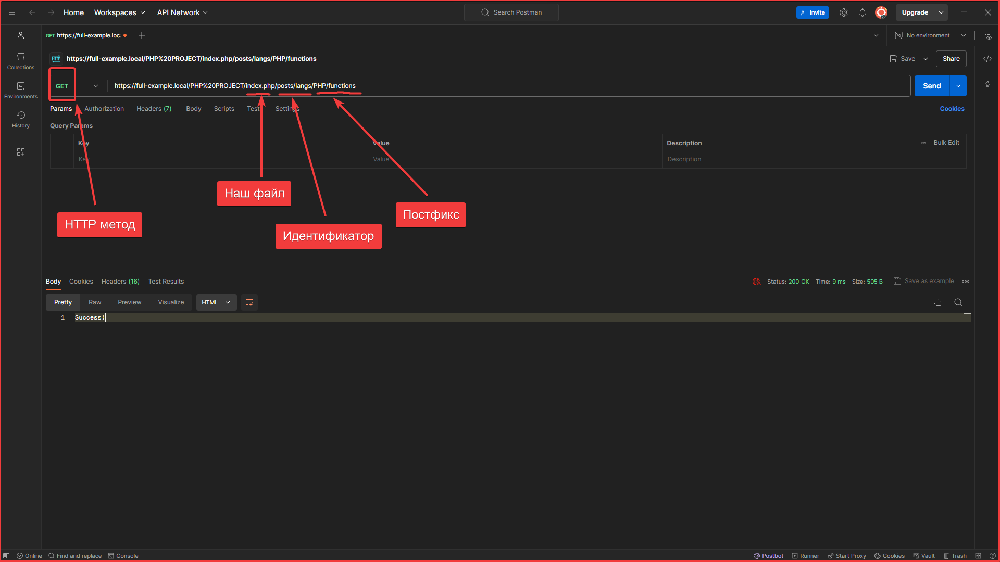

Как видите всё работает

Теперь попробуем изменить метод и путь

Меняем МЕТОД:

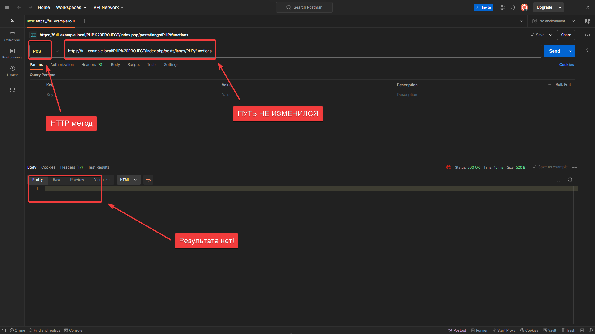

Меняем ПУТЬ:

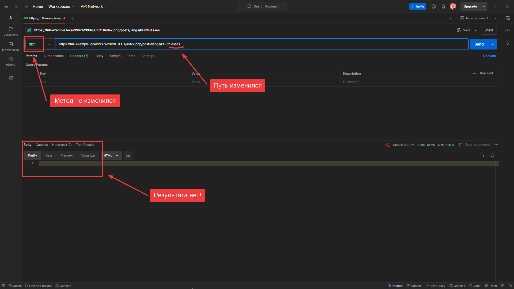

*********************

Чтобы метод не имел значения, ставим HTTPMethod::ALL_METHODS

```php
<?php

require_once __DIR__ . "/vendor/autoload.php";

// Наш основной класс
use GudeAPI\GudeAPI;

// Режимы API
use GudeAPI\RequestType;

// Список HTTP методов
use GudeAPI\HTTPMethod;

// Инициализируем объект
$api = new GudeAPI(
    RequestType::PATH("posts/langs")
);

// Вызываем функцию для проверки URL
$api->PATH(HTTPMethod::ALL_METHODS, "PHP/functions", function() {
    echo "Success!";
});
```

Метод POST:

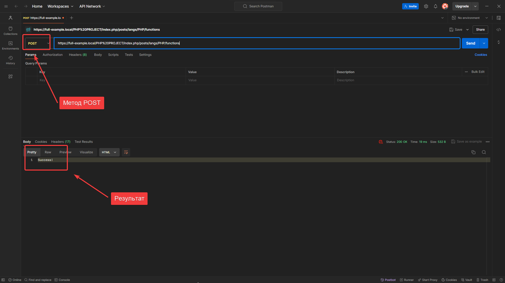

Метод GET:

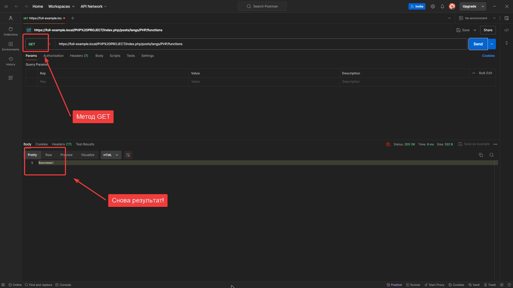

Как видете работает!

*************************

## Что принимает action?

Функция пользователя action принимает массив $properties с некоторыми полезными параметрами

```php
// Вызываем функцию для проверки URL
$api->PATH(HTTPMethod::ALL_METHODS, "PHP/functions", function(array $properties) {
    echo "Success!";
});
```

В массиве есть элементы:

    * HTTPMethod - содержти HTTP метод этой функции

    * IdentifierInRequestPath - содержти идентификатор этой функции

    * PostfixInRequestPath - содержти постфикс этой функции       

    * DynamicElements - содержит массив динамических элементов этой функции            

    * SpecialElements - содержит массив специальных элементов этой функции                        

    * ElementsAfterSpecialElement - содержит массив расспарсенных специальных элементов этой функции            

## Динамические элементы

Динамические элементы - это элементы, которые должны присутствовать в URL, но они не конкретезированы

Синтаксис Динамического элемента - {:название:}

Динамические элементы могут распологаться как и в идентификаторе, так и в постфиксе

Пример с динамическими элементами в постфиксе:

```php
<?php

require_once __DIR__ . "/vendor/autoload.php";

// Наш основной класс
use GudeAPI\GudeAPI;

// Режимы API
use GudeAPI\RequestType;

// Список HTTP методов
use GudeAPI\HTTPMethod;

// Инициализируем объект
$api = new GudeAPI(
    RequestType::PATH("posts/langs")
);

// Вызываем функцию для проверки URL
$api->PATH(HTTPMethod::ALL_METHODS, "{:lang:}/functions", function(array $properties) {
    print_r( $properties["DynamicElements"] );
});
```

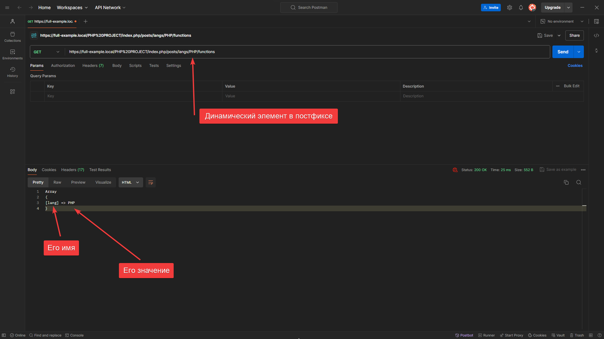

Пример с динамическими элементами в идентификаторе:

```php
<?php

require_once __DIR__ . "/vendor/autoload.php";

// Наш основной класс
use GudeAPI\GudeAPI;

// Режимы API
use GudeAPI\RequestType;

// Список HTTP методов
use GudeAPI\HTTPMethod;

// Инициализируем объект
$api = new GudeAPI(
    RequestType::PATH("posts/{:category:}")
);

// Вызываем функцию для проверки URL
$api->PATH(HTTPMethod::ALL_METHODS, "PHP/functions", function(array $properties) {
    print_r( $properties["DynamicElements"] );
});
```


Пример с динамическими элементами в идентификаторе и постфиксе:

```php
<?php

require_once __DIR__ . "/vendor/autoload.php";

// Наш основной класс
use GudeAPI\GudeAPI;

// Режимы API
use GudeAPI\RequestType;

// Список HTTP методов
use GudeAPI\HTTPMethod;

// Инициализируем объект
$api = new GudeAPI(
    RequestType::PATH("posts/{:category:}")
);

// Вызываем функцию для проверки URL
$api->PATH(HTTPMethod::ALL_METHODS, "{:lang:}/functions", function(array $properties) {
    print_r( $properties["DynamicElements"] );
});
```

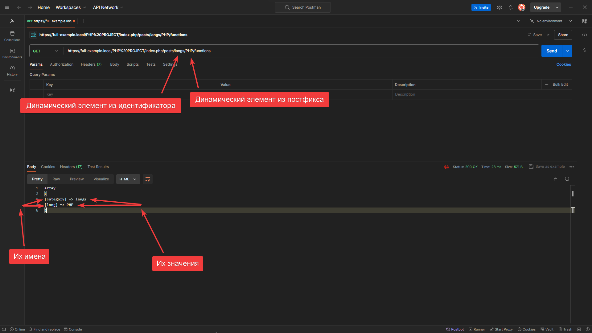

****************

## Специальные элементы и Элементы после специального элемента

Специальные элеиенты - это элементы, которые влияют на проверку URL

В данный момент существует только один специальный элемент:

* Конец URL
    + Синтаксис - {|*|}

Специальный элемент означает, что все элементы, которые идут после него отбрасываються и не проверяються, это и есть __Элементы после специального элемента__

__ПРИМИЧАНИЕ: СПЕЦИАЛЬНЫЕ ЭЛЕМЕНТЫ МОГУТ ПИСАТЬСЯ ТОЛЬКО В ПОСТФИКСЕ, ЕСЛИ ОН БУДЕТ В ИДЕНТИФИКАТОРЕ, ТОГДА ВЫСКАЧИТ ОШИБКА SpecialParameterInIdentifier: Нельзя писать специальный параметр в идентификатор API__

```php
<?php

require_once __DIR__ . "/vendor/autoload.php";

// Наш основной класс
use GudeAPI\GudeAPI;

// Режимы API
use GudeAPI\RequestType;

// Список HTTP методов
use GudeAPI\HTTPMethod;

// Инициализируем объект
$api = new GudeAPI(
    RequestType::PATH("posts/langs")
);

// Вызываем функцию для проверки URL
$api->PATH(HTTPMethod::ALL_METHODS, "PHP/functions/{|*|}", function(array $properties) {
    print_r( $properties["SpecialElements"] );
    echo PHP_EOL;
    print_r( $properties["ElementsAfterSpecialElement"] );
});
```

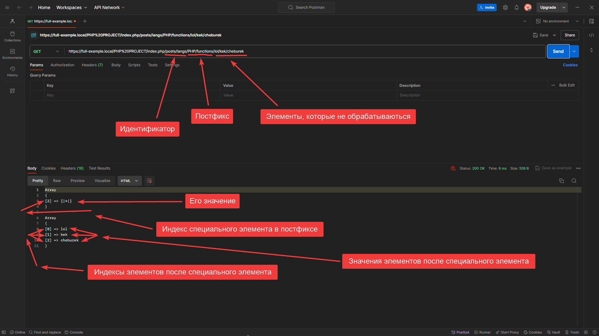

***************************

## Практика

Задание: создать API для языком программирования и фреймворков

```php
<?php

require_once __DIR__ . "/vendor/autoload.php";

// Наш основной класс
use GudeAPI\GudeAPI;

// Режимы API
use GudeAPI\RequestType;

// Список HTTP методов
use GudeAPI\HTTPMethod;

// Инициализируем объект для языков языков программирования
$apiForLangs = new GudeAPI(
    RequestType::PATH("posts/langs")
);

// Инициализируем объект для языков фреймворков
$apiForFrameworks = new GudeAPI(
    RequestType::PATH("posts/frameworks")
);

$apiForLangs->PATH(HTTPMethod::GET, "{:lang:}/{|*|}", function(array $properties) {
    echo "Language";
    echo PHP_EOL;
    echo $properties["DynamicElements"]["lang"];
});

$apiForFrameworks->PATH(HTTPMethod::GET, "{:framework:}/{|*|}", function(array $properties) {
    echo "Frameworks";
    echo PHP_EOL;
    echo $properties["DynamicElements"]["framework"];
});
```

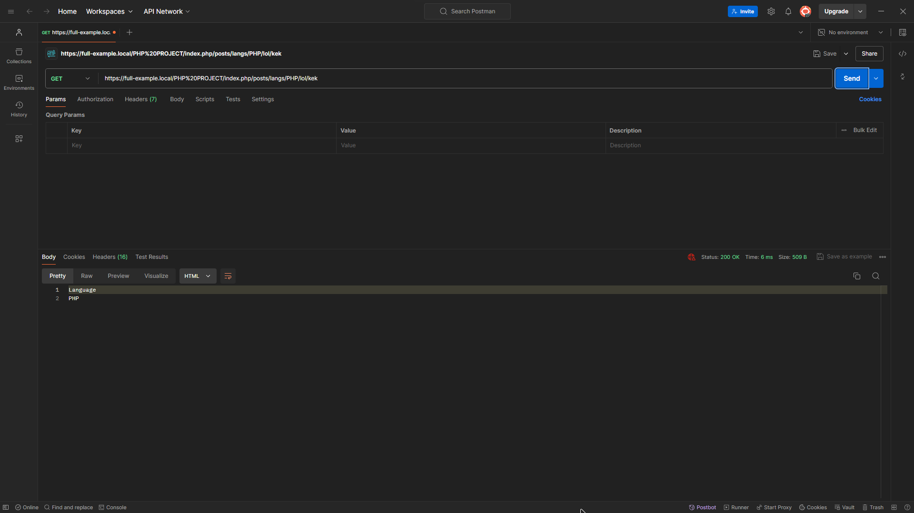


Всё, Готово!!!

Горжусь вами!

И Спасибо, что используете мою библитотеку!

Так Держать!!! 👍👍👍